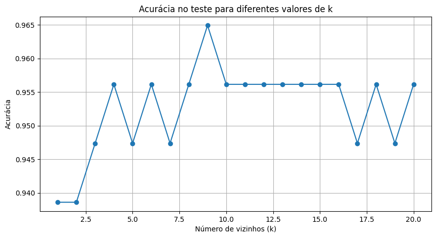
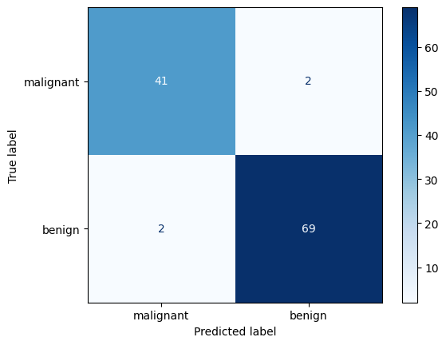
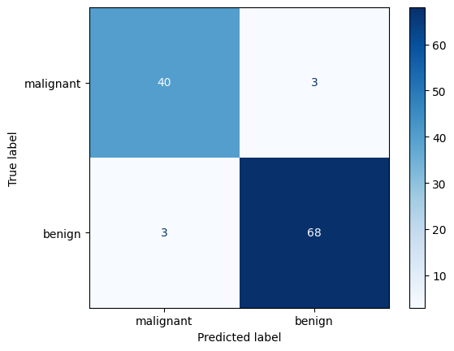

# Usar KNN para prever se um tumor é maligno ou benigno

## O dataset está disponível na biblioteca sklearn, e possui 30 caracterpisticas numéricas extraídas das imagens  dos tumores, como raio médio, textura média, concavidade, área média, simetria, etc.

---

# Uso de validação cruzada

## A acurácia por fold teve uma variação pequena, a menor porcentagem de acerto foi de 92.3% e a maior foi de 98,9%. Isso nos dá uma estimativa mais confiǘel de como o modelo deve performar em dados nunca vistos. O resultado nos indica que o KNN está tendo uma boa capacidade de generalização.

---
## Análise para diferentes K

---

# Resultados

## Matriz de Confusão com o K = 9

---

## Matriz de Confusão com K = 5

