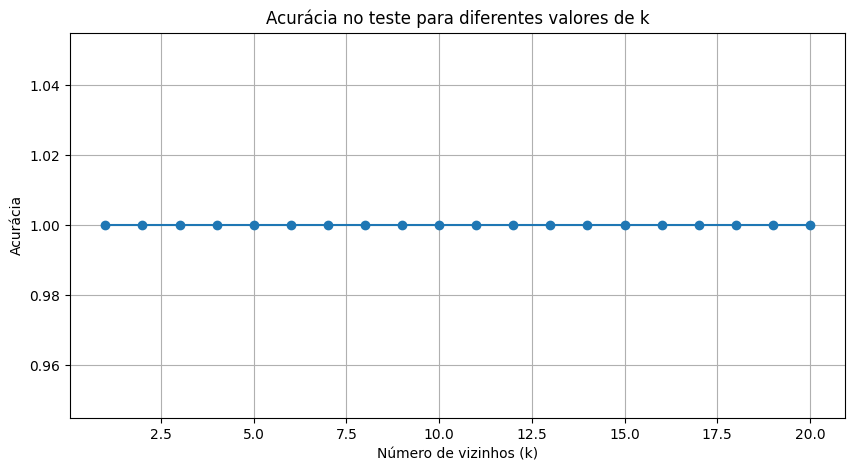
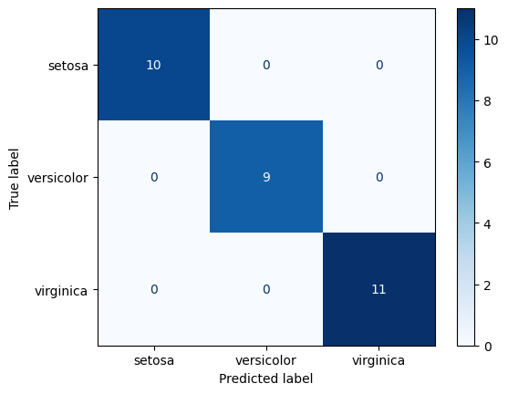

# Usar KNN para prever qual a classe correta de uma flor

## O dataset está disponível na biblioteca sklearn, e possui 4 características e 3 classes que são: Setosa, Versicolor e Virginica.

---

# Uso de validação cruzada

## A acurácia teve uma média de 92.5% de acerto. Isso nos dá uma estimativa mais confiǘel de como o modelo deve performar em dados nunca vistos. O resultado nos indica que o KNN está tendo uma boa capacidade de generalização.

---
## Análise para diferentes K

---

# Resultados

## Matriz de Confusão com o K = 9

---

## Matriz de Confusão com K = 5

